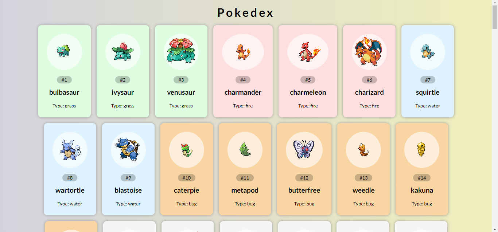

# Projeto Pokedex (HTML, CSS e Javascript)

Projeto para listar pokemons usando a api https://pokeapi.co/

## Design do Projeto



## Exemplo de uso da API (https://pokeapi.co/)

Abaixo um exemplo de requisição do pokemon bulbasaur pelo id e nome.

### Requisitando pokemon pelo **id**

```
https://pokeapi.co/api/v2/pokemon/1
```

### Requisitando pokemon pelo **nome**

```
https://pokeapi.co/api/v2/pokemon/bulbasaur
```

### Requisitando imagem do pokemon pelo **id**

```
https://raw.githubusercontent.com/PokeAPI/sprites/master/sprites/pokemon/1.png
```
